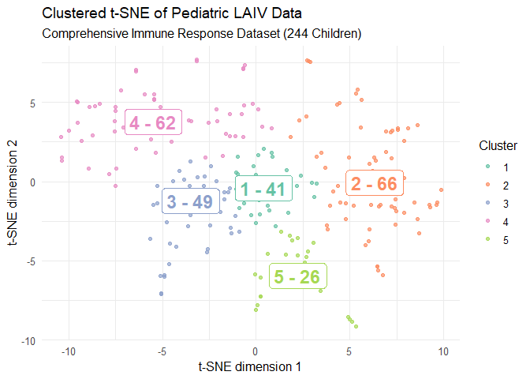

immunaut
================
Ivan Tomic <info@ivantomic.com>

<!-- README.md is generated from README.Rmd. Please edit that file -->

## Installation

You can install the released version of **immunaut** from
[CRAN](https://CRAN.R-project.org) with:

``` r
install.packages("immunaut")
```

Or you can install **immunaut** directly from **GitHub** with use of
following commands:

``` r
# install.packages("devtools")
devtools::install_github("atomiclaboratory/immunaut", subdir = 'R-package')
```

## Initial setup

``` r
library("immunaut")

# Generate a demo dataset with 1000 subjects, 200 features, 4 clusters, and a 10% probability of missing values
dataset <- generate_demo_data(n_subjects = 1000, n_features = 200, 
                                desired_number_clusters = 4, # Approximate number of clusters
                                cluster_overlap_sd = 35, # Standard deviation for cluster overlap
                                missing_prob = 0.1) # Probability of missing values

# Generate a file header for the dataset to use in downstream analysis
file_header <- generate_file_header(dataset)

settings <- list(
    fileHeader = file_header,
    seed = 1337,
    selectedColumns = colnames(dataset),  # Columns selected for analysis
    # Exclude outcome, age, and gender columns from the analysis
    excludedColumns = c("outcome", "age", "gender"),
    removeNA = TRUE,
    
    # Clustering parameters
    clusterType = "Louvain",
    target_clusters_range = c(3, 4),
    resolution_increments = c(0.1, 0.2, 0.3),
    min_modularities = c(0.4, 0.5, 0.6),
    pickBestClusterMethod = "Overall",  # "Overall", "Modularity", or "Silhouette"
    
    # Preprocessing and Machine Learning settings
    outcome = "immunaut",
    preProcessDataset = c("scale", "center", "medianImpute", "zv"),
    selectedPartitionSplit = 0.7,  # 70% train, 30% test (strictly isolated)
    selectedPackages = c("rpart"),
    trainingTimeout = 180,
    num_cores = 1
)
```

## Example 1: Perform t-SNE, Louvain Clustering, and Machine Learning

``` r
# Perform t-SNE and clustering using the 'immunaut' function
result <- immunaut(dataset, settings)

# Plot the clustered t-SNE results using ggplot2
p <- plot_clustered_tsne(result$tsne_clust$info.norm, 
                         result$tsne_clust$cluster_data, 
                         result$settings) 
print(p) # Display the plot

# Machine Learning with Complete Data Isolation:
# 'dataset_ml' contains the dataset with the 'immunaut' cluster assignment column attached.
dataset_ml <- result$dataset$dataset_ml

# auto_simon_ml() partitions the dataset into train/test sets BEFORE preprocessing,
# ensuring zero data leakage between training and testing sets.
model_results <- auto_simon_ml(dataset_ml, settings)

# Inspect model performance on the isolated test partition
for (model_name in names(model_results$models)) {
  m <- model_results$models[[model_name]]
  cat("Model:", model_name, "\n")
  cat("  Accuracy:     ", round(m$predictions$postResample["Accuracy"], 3), "\n")
  cat("  Macro F1:     ", round(m$predictions$macroF1, 3), "\n")
  cat("  AUROC:        ", round(m$predictions$AUROC, 3), "\n")
  cat("  Weighted AUROC:", round(m$predictions$weightedAUROC, 3), "\n")
}

# The fitted preprocessing parameters are preserved for external cohort validation:
print(model_results$preProcessParams)
```

## Example 2: Switch to DBSCAN Clustering

``` r
# Update settings for DBSCAN clustering
settings$clusterType <- "Density"
settings$minPtsAdjustmentFactor <- 1.5
settings$epsQuantile <- 0.9

# Run t-SNE and DBSCAN clustering
dbscan_result <- immunaut(dataset, settings)
```

## Example 3: Perform Mclust Clustering

``` r
# Update settings for Mclust clustering
settings$clusterType <- "Mclust"
settings$clustGroups <- 3  # Specify the number of clusters for Mclust

# Run t-SNE and Mclust clustering
mclust_result <- immunaut(dataset, settings)
#> [1] "==> cluster_tsne_mclust clustGroups:  3"
```

## Example 4: Perform Hierarchical Clustering

``` r
# Update settings for Hierarchical clustering
settings$clusterType <- "Hierarchical"
settings$clustLinkage <- "ward.D2"
settings$clustGroups <- 3

# Run t-SNE and Mclust clustering
hierarchical_result <- immunaut(dataset, settings)
```

## Example 5: Visualize High-Dimensional Feature Space with PCA

``` r
# Perform PCA on preprocessed numeric features
feature_cols <- grep("^Feature", names(result$dataset$preprocessed), value = TRUE)
pca_res <- prcomp(result$dataset$preprocessed[, feature_cols], center = TRUE, scale. = TRUE)

pca_df <- data.frame(
  PC1 = pca_res$x[, 1],
  PC2 = pca_res$x[, 2],
  Cluster = factor(result$clusters)
)

library(ggplot2)
ggplot(pca_df, aes(x = PC1, y = PC2, color = Cluster)) +
  geom_point(alpha = 0.7, size = 2.5) +
  stat_ellipse(level = 0.8) +
  scale_color_brewer(palette = "Set1") +
  labs(
    title = "PCA of Clustered Cohort",
    x = "Principal Component 1",
    y = "Principal Component 2",
    color = "Cluster"
  ) +
  theme_classic()
```

## Example 6: Using Pediatric LAIV Vaccination Dataset

``` r
library(immunaut)
library(ggplot2)

data("immunautLAIV")


file_header <- generate_file_header(immunautLAIV)

# Base settings (shared across all runs unless overridden):
settings <- list()
settings$fileHeader <- file_header

settings$selectedColumns <- c(
  "H1_HAI_FC","H3_HAI_FC","B_HAI_FC","H1N1_NA_FC","H3_HA_IgA_FC",
  "B_HA_IgA_FC","B_NA_IgA_FC","H1_CD8_IFNg_FC","H3_CD8_IFNg_FC",
  "H3_CD8_IL2_FC","HAB_CD8_IFNg_FC","HAB_CD8_IL2_FC","NC99_H1_FC",
  "SWISS_H3_FC","HK14_H3_FC","KAN_H3_FC","B_PHU_FC","cH7_IgA_FC",
  "N2_FC","cH6_FC"
)
settings$groupingVariables <- c(
  "max_HAI_responder","max_iga_responder","max_mnp_cd4_responder",
  "max_mnp_cd8_responder","year","sex","v0_resp_virus_positive",
  "h1_v2_shed","h3_v2_shed","b_v2_shed","h1_v7_shed","h3_v7_shed",
  "b_v7_shed","h1_v0_seropositive","h3_v0_seropositive","b_v0_seropositive"
)


settings$preProcessDataset <- c("medianImpute","center","scale","corr","nzv","zv")

result <- immunaut(immunautLAIV, settings)

p <- plot_clustered_tsne(result$tsne_clust$info.norm, 
                                result$tsne_clust$cluster_data, 
                                result$settings) 
# Adjust the plot: use Set2 palette and a nice minimal theme
p <- p +
  scale_color_brewer(palette = "Set2") +
  theme_minimal(base_size = 12) +
  labs(
    title    = "Clustered t-SNE of Pediatric LAIV Data",
    subtitle = "Comprehensive Immune Response Dataset (244 Children)",
    color    = "Cluster"
  )

print(p)
```


